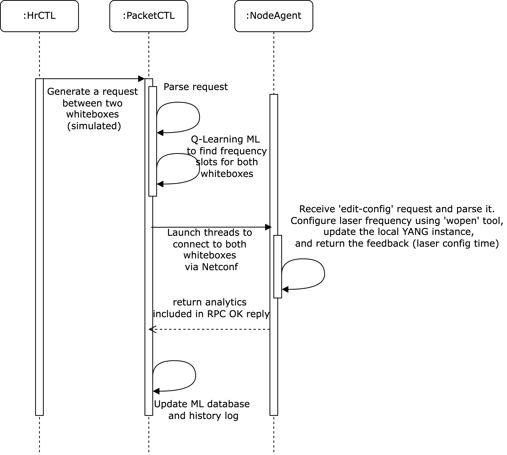

### Astrape for Netconf (c) 2024-2025 by Constantine Kyriakopoulos
#### Version: 0.1
#### License: GNU GPL Version 2
#### zfox@users.sourceforge.net

Packet-optical node transceiver frequency allocation.

### Introduction

In an optical network scenario which consists of multiple nodes (whiteboxes) at its edges and ROADMs in-between, the 
coherent transceiver average laser configuration time is improved. The process is evaluated according 
to a testbed setup. This is facilitated in the appropriate lab equipment (or via simulation when required).

For that purpose, a software agent (Netconf server) residing at the whiteboxes, is developed receiving input 
from the Software-Defined Networking (SDN) packet controller (PacketCTL - a Netconf client). Then, configuration 
of the local transceiver laser frequencies of the controlled pluggable devices takes place, for facilitating the 
connectivity in-between the ROADM network. Also, the agent records and reports back telemetry data (feedback) which 
is used by the PacketCTL's resource-allocating mechanism to improve efficiency within the network topology.

PacketCTL is able to improve the overall control plane configuration time, by utilising an internal 
Feed-forward Neural Network (FNN) which is based on Q-Learning (QL). This Reinforcement Learning (RL) 
mechanism adapts to the current operating environment by efficiently allocating frequency slots to 
the pluggables, decreasing the average laser configuration times. To achieve this, it exploits the 
previous configuration times as feedback input while in learning state.

### Prerequisites to execution

First, compile _wopen_sim.cpp_. This is the simple simulator that configures the laser frequency of the pluggable. 
Next, install both the _pyang_ library (e.g., v2.6.1) and the plugin _pyangbind_ (e.g., v0.8.6). This represents 
the YANG instance by a Python class instance. Replace paths with the correct local ones.

<pre>
% pyang --plugindir /opt/homebrew/lib/python3.12/site-packages/pyangbind/plugin -f pybind \
-o /stuff/coding/astrape_nc/modules/pluggable_config.py \
/stuff/coding/astrape_nc/modules/pluggable-config@2024-11-19.yang
</pre>

### Sequence of events from the initial command to setting the pluggable frequency

The procedure of setting a specific laser frequency on a pluggable device is depicted as a sequence 
in the next figure. Initially, a request is generated from the HrCTL, including a pair of 
whiteboxes. The local DB of PacketCTL contains previous feedback values (configuration times) per 
transceiver ID in each whitebox. An RL method based on QL is applied and the transceiver frequency slots 
are chosen to fulfil the request. Next, it launches system threads to connect concurrently to both whiteboxes 
via the Netconf protocol, using an XML RPC _edit-config_ structure that contains the pluggable ID and 
the chosen slot. After successful configuration, the whitebox returns embedded in the RPC XML OK message, the 
actual configuration time as feedback. Finally, the controller updates its local DB accordingly.

  

### Usage

Configure the system, train the ML agent (multiple attempts to produce efficient results), launch some optical nodes 
with separate shell processes, execute the packet controller. Connectivity is realised via system socket files.

### Changelog

<pre>
0.1    2025-03-03    Initial release.
</pre>
